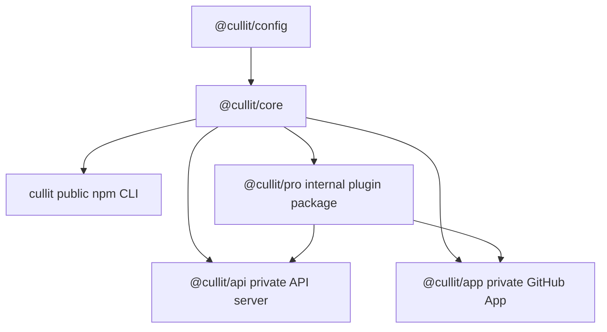
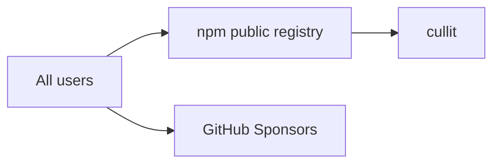
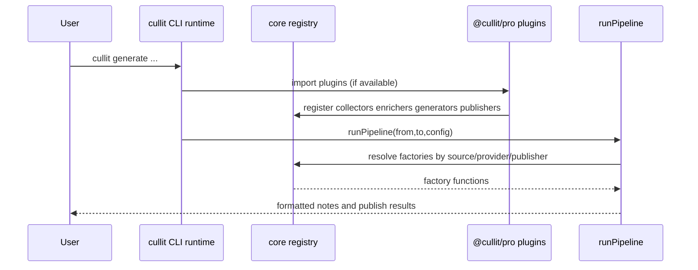
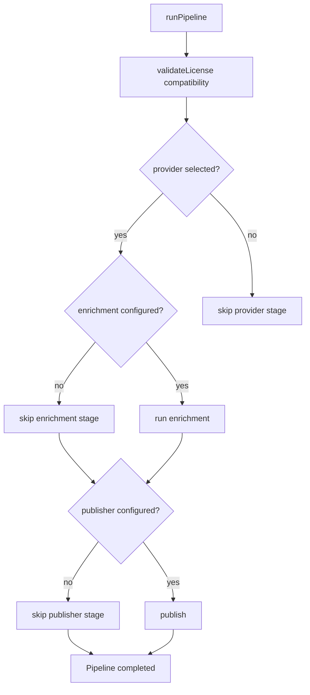
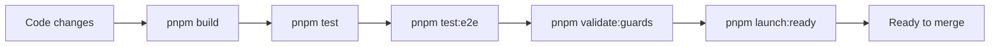

# Cullit Architecture

Last updated: 2026-05-04

This document is the source of truth for Cullit's technical architecture, distribution model, runtime flows, and operational boundaries.

## Scope

- Monorepo package topology
- Open-source distribution boundaries
- Runtime plugin registration and compatibility behavior
- API and dashboard request flows
- Quality gates and release checks

## Package Topology

## Distribution Model

### Boundaries

- `cullit` is the public package for all workflows.
- Paid plan-specific distribution packages are retired.
- `@cullit/pro` remains an internal package in the monorepo, but no longer represents a paywall boundary.

## Runtime Plugin Registration

## Gating and Tier Controls

### Tier Expectations

- Legacy tier values (`free`, `paid`, `pro`, `team`, `enterprise`) are kept for compatibility and analytics continuity.
- Runtime behavior is open-access: features are not blocked by tier.
- Billing endpoints are retained as compatibility stubs and no longer perform checkout.

## API and Dashboard Flow

## Quality Gates

## Operational Notes

- Sponsorship CTA should point to `https://github.com/sponsors/mttaylor`.
- Billing and Stripe references in product docs are considered legacy and should be removed when touched.
- Public docs should reflect open-source and contribution-first messaging.

## Documentation Maintenance Policy

When architecture, distribution, or runtime flows change, update this file in the same PR.

Required updates when relevant:

- package topology or dependency direction changes
- compatibility tier behavior or install paths change
- authentication or gating logic changes
- API route behavior affecting dashboard/runtime flows changes
- build/test pipeline changes

If a PR changes any of the above and this file is untouched, treat that as a documentation gap.
