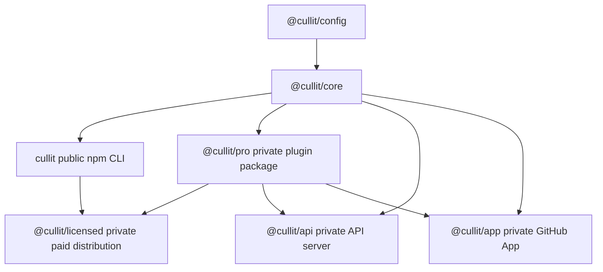
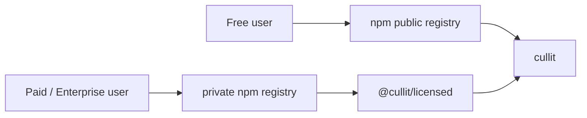
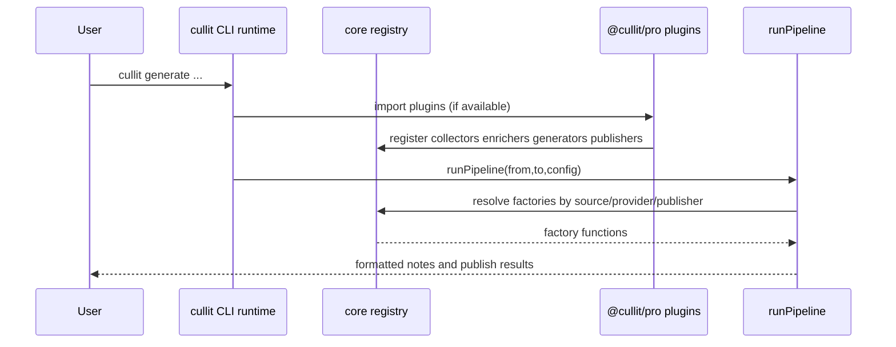
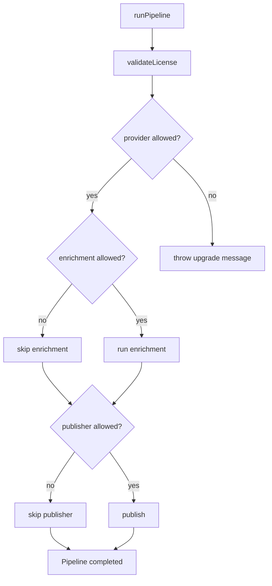
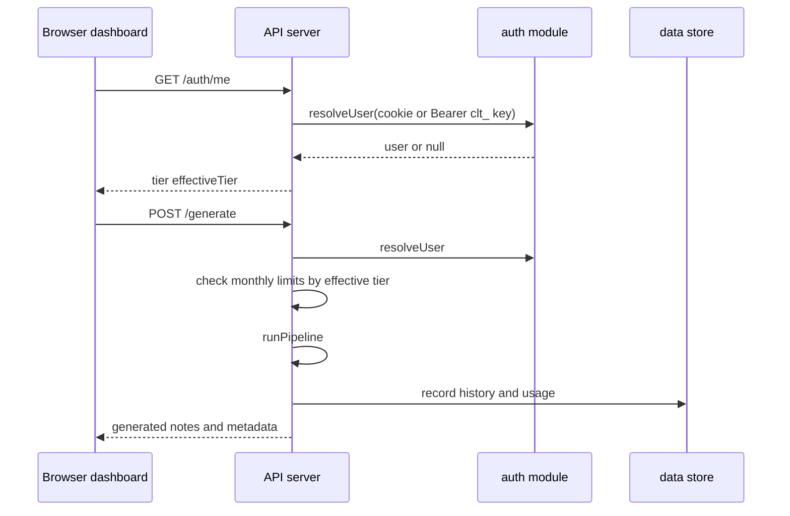
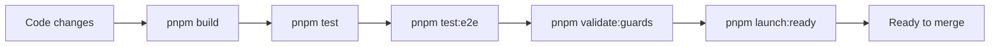

# Cullit Architecture

Last updated: 2026-03-27

This document is the source of truth for Cullit's technical architecture, distribution model, runtime flows, and operational boundaries.

## Scope

- Monorepo package topology
- Free vs paid distribution boundaries
- Runtime plugin registration and gating
- API and dashboard request flows
- Quality gates and release checks

## Package Topology

## Distribution Model

### Boundaries

- `cullit` is the public package for local/template workflows.
- `@cullit/licensed` is the private distribution package for paid tiers.
- `@cullit/pro` remains internal/private plugin implementation and is not a public customer install target.

## Runtime Plugin Registration

## Gating and Tier Controls

### Tier Expectations

- Free: local source + template provider + stdout/file publishers. 3 AI gens/month (BYOK).
- Paid ($8/seat/mo): All features — AI providers, enrichment, publishers, dashboard, orgs, drafts, team keys. 500+ gens/month, 100+ projects. Scales with seat count. Annual billing at $6.80/seat/mo.
- Enterprise: All Paid capabilities plus SSO/SAML, dedicated support, on-prem, unlimited gens/projects.

## API and Dashboard Flow

## Quality Gates

## Operational Notes

- `@cullit/licensed` should be published only to private registries.
- Customer onboarding should include `.npmrc` private registry auth setup.
- Public docs must never instruct paid users to install `@cullit/pro` directly.

## Documentation Maintenance Policy

When architecture, distribution, or runtime flows change, update this file in the same PR.

Required updates when relevant:

- package topology or dependency direction changes
- free/paid boundaries or install paths change
- authentication or gating logic changes
- API route behavior affecting dashboard/runtime flows changes
- build/test pipeline changes

If a PR changes any of the above and this file is untouched, treat that as a documentation gap.
